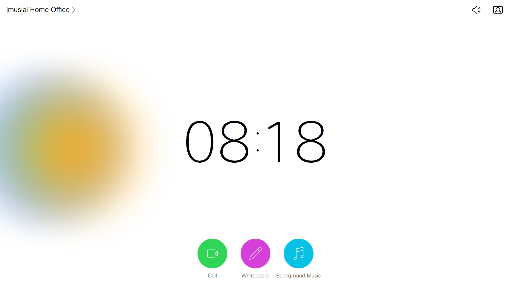
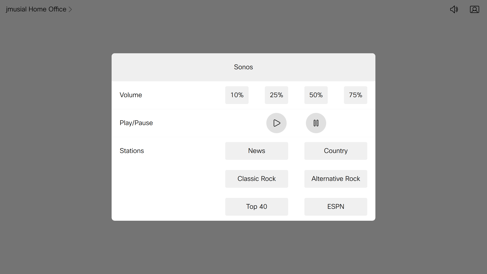
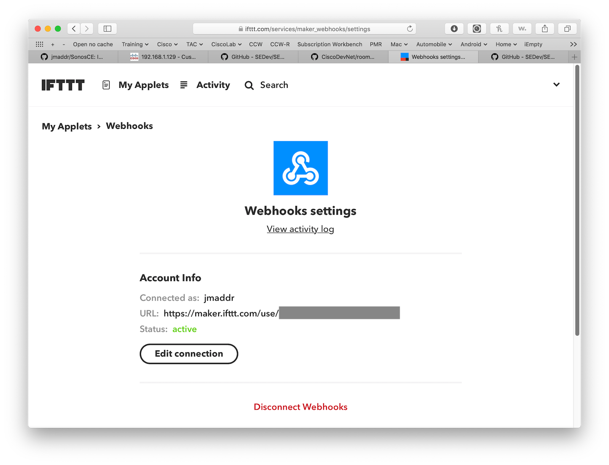

# SonosCE
This macro and corresponding In-Room Control sample demonstrates how to create an in-room control application that controls the background music in the same room as the codec.  This specific Macro controls a previously created Sonos account via IFTT webhooks.
Further, it provides and auto-mute and auto-resume of the background music upon an incoming or outgoing call notification.

---
Snapshot of Touch 10 Home Screen Panel with Background Music button:

Snapshot of Touch 10 Home Screen Panel after pressing the background Music button:

---

This sample gadget contains the following files:

	README.md (this file)
	SonosCE.js (the javascript macro)
	sonos.xml (the in-room control XML file)
    	Screenshot-SonosCE_MainScreen.png (sample image)
    	Screenshot_SonosCE_sonosControl.png (sample image)
   	ProvisionableApplicationPackage_SonosCE.zip (Package for provisioning)

## Requirements
1. Cisco Video room device (Room Kit devices only)
2. Firmware CE9.6.1 or newer
3. Sonos hardware and previously setup Sonos account with favorites
4. IFTTT account with Sonos and webhooks services configured

## Additional Information
##### XAPI
Documentation for the Cisco XAPI can be found in the [Command References overview](https://www.cisco.com/c/en/us/support/collaboration-endpoints/telepresence-quick-set-series/products-command-reference-list.html).

##### IFTTT
Documentation for the IFFTT webhook service can be found at this [IFFF service page](https://ifttt.com/services/maker_webhooks).

##### Sonos
Dcoumentation for Sonos hardware and the Sonos service can be found at the main [Sonos main page](http://www.cisco.com).

## How to provision
### 1. Setup IFTTT webhooks service
  - Navigate to the IFTTT [web page](http://www.ifttt.com].
  - Add the Sonos service if you have not already done so.
  - Add the webhooks service if you have not already done so.
  - Copy your personal webhook identifier to the clipboard.  This will be a multicharacter personal identifier.  you can find this identifier by navigating on the IFTTT website to "My Applets - Services - Webhooks - Settings" or directly by clicking [this link](https://ifttt.com/maker_webhooks).  The identifer is shown in the following image under the grey box.  
  - Create webhooks for the following actions, selecting the appropriate Sonos player (or group of players).
  	- Pause
	- Resume
  - Create webhooks for the volume settings.  If you wish only a single volume not controlled by the codec, you can skip this step.
	- volumeSet10
	- volumeSet25
	- volumeSet50
	- volumeSet75
  - Create webhooks for the following "stations" you intend to play.  Create as many or as few as you like.  If you only have one station you intend to use, you can skip this step.  These "stations" correspond to stations in your Sonos playlist.
	- News
	- Country
	- ClassicRock
	- AlternativeRock
	- Top40
	- ESPN

### 2. Download the files to the codec
  - Log on to codec web interface with Admin Credentials
  - Navigate to 'Maintenance' - 'Backup and Restore'
  - Select 'Restore backup'
  - Select the ZIP file in this repo (Package for provisioning)
  - Press 'Upload file'
 
 ### 3. Personalize the macro and in-room console
 In these next steps, you will be modifying the macros with your personal identifying information
 #### In room-console
  - Log on to codec web interface with Admin Credentials
  - Navigate to 'Integration - In-Room Control'
  -
  -
 #### SonosCE macro
  - Log on to codec web interface with Admin Credentials
  - Navigate to 'Integration - Macro Editor'
  - Select the "SonosCE" macro
  - Change the variable authForIFTTT to the hash that you obtained in the IFTTT webhooks section.  NOTE: If this ever changes, you will need to re-visit the macro and update it there accordingly.
  
	

  Scripting using API:
    - xCommand Provisioning Service Fetch Mode:Add URL: 'https://<YourPath>/nameofroomdeviceprovisioningfile.zip'

## Disclaimer
This example is only a sample and is **NOT guaranteed to be bug free and production quality**.

The sample macros are meant to:
- Illustrate how to use the CE Macros.
- Serve as an example of the step by step process of building a macro using JavaScript and integration with the Codec XAPI
- Provided as a guide for a developer to see how to initialize a macro and set up handlers for user and dialog updates.

The sample macros are made available to Cisco partners and customers as a convenience to help minimize the cost of Cisco Finesse customizations. Cisco does not permit the use of this library in customer deployments that do not include Cisco Video Endpoint Hardware.

## Support Notice
[Support](http://developer.cisco.com/site/devnet/support) for the macros is provided on a "best effort" basis via DevNet. Like any custom deployment, it is the responsibility of the partner and/or customer to ensure that the customization works correctly and this includes ensuring that the macro is properly integrated into 3rd party applications.

It is Cisco's intention to ensure macro compatibility across versions as much as possible and Cisco will make every effort to clearly document any differences in the XAPI across versions in the event that a backwards compatibility impacting change is made.

Cisco Systems, Inc. 
[http://www.cisco.com](http://www.cisco.com) 
[http://developer.cisco.com/site/roomdevices](http://developer.cisco.com/site/roomdevices)
